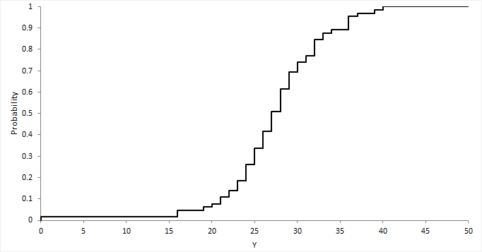

[> Go to Data Science Contents](../)

## Basic probability & statistics
### Probability (확률)
likelihood of events
이벤트의 가능성

The probalitiy $p(s)$ of an outcome s satisfies:    
- $0 \leq p(s) \leq 1$: 확률은 0~1의 값을 가진다.
- $\sum_{s\in S} p(s) = 1$: 모든 event의 합을 더했을 때 1이 되야함

### Probability vs. Statistics
확률 vs. 통계     
Probability: predicting the likelihood of future    events     
      Event가 발생할 확률, 정도   
예측하는데 주로 사용    

Statistics: analyzes the frequency of past events   
      이전에 발생했던 event들을 분석      
데이터를 보고 분석하는데 주로 사용

### Compound Events and Independence
- event A: 학생들 중 절반이 여성이다.
- event B: 절반 이상의 학생이 중앙값을 넘는다.

이때 학생이 A이자 B일 확률은?     
Events A와 B가 각각 독립적일 때   
- $P(A \cap B) = P(A) \times P(B)$    

독립적인 가설은 계산할때는 편리하지만, 실제로 예측하는데는 좋지 않다.   
하지만 자주 사용됨.

### Conditional Probability
B 사건이 일어났을 때 A사건이 일어날 확률 ($P(A\vert B)$)
- $P(A\vert B) = \frac{P(a\cap b)}{P(B)} = \frac{\text{A와 B가 발생할 경우의 수}}{\text{B가 발생할 경우의 수}}$   
두 사건이 서로 Independent하다면, $P(A\vert B)$는 $P(A)$
가 된다.    

### Bayes Theorem
베이즈 정리
- $P(B\vert A) = \frac{(P(A\vert B)P(B))}{P(A)}$  

$P(A\cap B)$: 두 사건 A와 B가 발생할 확률   
$P(A)$: A가 발생할 확률   
$P(B\vert A)$: A가 발생하였을 때 B가 발생할 확률    
- $P(A\cap B) = P(A)P(B\vert A)$    
- $P(A\cap B) = P(B)P(A\vert B)$    
- $P(A)P(B\vert A) = P(B)P(A\vert B)$  
- $P(A\vert B) = P(A)\frac{P(B\vert A)}{P(B)}$    

$P(A\vert B)$: 사후 확률(Posterior probability), 사건 B가 발생했을 때 사건 A가 발생하는 조건부 확률      
$P(B\vert A)$: 가능도(likelihood), 사건 A가 발생했을 때 사건 B가 발생하는 조건부 확률   
$P(A)$: 사전 확률(prior) H(hypothesis), 사건 A가 발생할 확률      
$P(B)$: 증거(evidence) E(evidence), 사건 B가 발생할 확률

#### Example
질병 A의 발병률은 0.1%. 이 지병이 실제로 있을 때 질병이 있다고 검진할 확률 (민감도; sensitivity)은 99%, 질병이 없을 때 실제로 질병이 없다고 검진할 확률 (특이도; specificity)는 98%   
**어떤 사람이 질병에 걸렸다고 검진 받았을 때, 정말 질병에 걸렸을 확률?**    

Hypothesis: True(실제로 병이 있다)    
Evidence: Positive (병이 있다고 진단을 받았다)    

- $P(H) = 0.001$: 실제로 병이 있을 확률
- $P(E\vert H) = 0.99$: 실제로 병이 있을 때 병이 있다고 판단할 확률
- $P(E) = $병이 있는데 병이 있다고 진단 받을 확률 + 병이 없는데 병이 있다고 진단 받을 확률 = 0.99 + 0.02 = 1.01$
- $P(E^c\vert H^c) = 0.98$    
- $P(H\vert E) = \frac{P(E\vert H)P(H)}{P(E)} = \frac{P(E\vert H)P(H)}{P(E)} = \frac{0.99 \times 0.001}{1.01} = 0.0098...$    
따라서 0.98%

#### Sensitivity and Specificity
    
왼쪽: positive samples      
오른쪽: negative smaples    
원: positive라고 예측한 부분    
일 때,    
True positive: True라고 예측한 부분이 True가 맞음     
False positive: True라고 예측한 부분이 False         
True negative: False라고 예측한 부분이 True     
False negative: False라고 예측한 부분이 False가 맞음   

여기서 Sensitivity(민감도)란, $\frac{\text{True positive}}{\text{positive samples}}$        
Specificity(특이도)란, $\frac{\text{False negative}}{\text{negative samples}}$    

### Distruibutions of Random Variables
**확률 변수의 분포**
- Probability density functions (PDFs, 확률 밀도 함수)    
    

histogram일 때도 있고, continous한 모델일 수도 있음.
각각 Entry 값들 (Random variable)의 합이 1이고, 각각의 값들이 0~1 사이의 값을 가짐.

### Probability/Cumulative Distributions
CDF(cumulative distribution function; 누적 분포 함수): PDF의 합을 구함
- $C(X \leq k) = \sum_{x\leq k} P(X=x)$   
      

### Descriptive Statistics

- Central tendency measures (중심 경향 측정)
  - mean(평균값): meaningful for symmetric distributions without outliers (특이점이 없는 대칭 분포에 의미가 있음) e.g., height and weight
  - median(중앙값): better for skewed distributions or data with outliers (skewness distributions(왜곡된 분포) 또는 노이즈가 많이 껴있는 곳에 더 좋음) e.g., wealth and income

- Variation or variability measures
  - variance(분산): square of the standard deviation(표준편차의 제곱)
    - $\hat{\sigma}=\sqrt{\frac{\sum_{i}^{n}(x_i-\bar{x})^2}{n-1}}$

#### Aggregation as Data Reduction
Representing a group of elements by a new derived element, like mean, min, count, sum reduces a large dataset to a small sumamry statistic    
큰 데이터 셋 -> 작은 통계로 줄어듬    

Such statistics can become **features** when taken over natural groups or clusters in the full data set   
이러한 통계는 features로 연계될 수 있다.

## Correlation Analyses
Correlation 분석: 2개의 변수 간에 선형적인 관계를 파악하고 싶을 때 사용 (어느정도 관계가 있는 지)   
**Causal relationship(인과관계)**를 나타내는 것은 아님! i.e., prediction model에 사용할 수 없음     

### Histogram

Random vaiable을 만들 때 자주 사용됨   
- "bin": range of values (막대그래프의 폭)    
- Quantization (이산화 과정)      

- Effect of number of bins      
  - Accurate assessment of distribution     
    분포에 대한 정확성을 평가함
  - Computational complexity      
    - kernel-based non-parametric PDF estimation (histogram or Parzen window)
      
분포를 표현하는 데에 영향을 끼침    
적당한 bin size를 찾는 것이 중요함    

Historgram은 frequency (probabilistic distribution)을 의미하는 것이지 correlation을 의미하는 것이 아니다.

### Correlation Coefficient (상관 계수)
- **$Corr_{XY} = \frac{Var(XY)}{\sigma_X \sigma_Y}$**
  - $Var(XY)$: covariance of X and Y (X와 Y의 공분산)
  - $\sigma_X$: standard deviation of X (X의 표준편차)
  - $\sigma_Y$: standard deviation of Y (Y의 표준편차)

## Vector and Matrices

### Vector
Vector: 값들의 1D array     
Notation $x \in \mathbb{R}^n$ 대부분의 Vector는 아래와 같은 형태로 (세로로) 표현    
\begin{align}
x &= \begin{bmatrix}
x_1 \newline
x_2 \newline
\vdots \newline
x_n
\end{bmatrix} \nonumber
\end{align}     
> $x^T = [x_1, x_2, ..., x_n]$, Transpose는 행과 열을 바꾸는 것이기 때문에 가로로 작성

### Matrices
Matrix: 값들의 2D array
Notation $A \in \mathbb{R}^{m\times n}$ 
\begin{align}
A &= \begin{bmatrix}
&A_{11} &\ldots &A_{1n} \newline
&\vdots &\ddots &\vdots  \newline
&A_{m1} &\ldots &A_{mn}
\end{bmatrix} \nonumber
\end{align}     

tabular data(table 형태로 표현되는 데이터)를 저장할 때 사용   

#### Example
"Grade" table:

|Person ID|HW1 Grade|HW2 Grade|
|---|---|---|
|5|100|80|
|6|60|80|
|100|100|100|     

이 데이터(primary key를 무시) Matrix로 표현하면

\begin{align}
A \in \mathbb{R}^{3\times 2} = \begin{bmatrix}
&100 &80 \newline
&60 &80 \newline
&100 &100
\end{bmatrix} \nonumber
\end{align}   

- Row major ordering: 100, 80, 60, 80, 100, 100
- Column major ordering: 100, 60, 100, 80, 80, 100

#### Higher dimensional matrices
"Higher dimensional matrices"는 Tensor라고 부른다.

## Basic of linear algebra
아래 식을 vector matrix form으로 작성하면?

\begin{align}
4x_1-5x_2&=-13 \nonumber \newline
-2x_1+3x_2&=9 \nonumber
\end{align}

$Ax=b$
\begin{align}
\text{where, } A= \begin{bmatrix}
4 &-5 \newline
-2 &3
\end{bmatrix}
, b = \begin{bmatrix} -13 \newline 9 \end{bmatrix},
\text{and } x = \begin{bmatrix}x_1 \newline x_2 \end{bmatrix} \nonumber
\end{align}

### Basic Matrix Operations
1. For $A, B \in \mathbb{R}^{m \times n}$, matrix addition/subtraction은 just the elementwise(각 요소 끼리만) addition/subtraction한다:
  - $C \in \mathbb{R}^{m \times n} = A+B \Leftrightarrow  C_{ij} = A_{ij}+B_{ij}$   
2. For $A \in \mathbb{R}^{m \times n}$, transpose is an operator that "flips" rows and columns (transpose는 행과 열을 뒤집음):
  - $C \in \mathbb{R}^{m \times n} = A^T \Leftrightarrow  C_{ji} = A_{ij}$   
3. For $A \in \mathbb{R}^{m \times n}, B \in \mathbb{R}^{n \times p}$ matrix multiplication(곱셈) is defined as
  - $C \in \mathbb{R}^{m \times p} = AB \Leftrightarrow  C_{ij} = \sum_{k=1}^{n} A_{ik}B_{kj}$   
4. Matrix multiplication is associative, distributive, but not commutative (size의 제약이 있기 때문)
  - $A(BC) = (AB)C \quad A(B+C)=AB+AC \quad (AB \neq BA)$

### Matrix Inverse
Identity matrix: 대각 행렬만 다 1인 Matrix ($i==j?1:0lms$)      
Identity matrix는 commutative하다.      
Inverse matrix: 어떤 matrix에 Inverse matrix를 곱했을 때 Identity matrix가 나오는 Matrix      
$A \in \mathbb{R}^{n \times n}, A^{-1} \in \mathbb{R}^{n \times n}$     
$AA^{-1} = I = A^{-1}A$: commutative      
이전에 나왔던 식 $Ax=b$를 inverse matrix를 사용해서 표연하면 간단하게 작성할 수 있다.   
$x = A^{-1}b$   

### Some Miscellaneous Definitions/Properties
- Transpose of matrix multiplication (Matrix 곱의 transpose), $A\in \mathbb{R}^{m \times n}, B \in \mathbb{R}^{n \times p}$     
  - $(AB)^T = B^TA^T$
- Inverse of product (Matrix 곱의 inverse), $A\in \mathbb{R}^{n \times n}, B \in \mathbb{R}^{n \times n}$     
  - $(AB)^{-1}= B^{-1}A^{-1}$
- Inverse of product (Matrix 곱의 inverse), $A\in \mathbb{R}^{n \times n}, B \in \mathbb{R}^{n \times n}$     
  - $(AB)^{-1}= B^{-1}A^{-1}$
- Inner product: for $x, y \in \mathbb{R}^n$
  - $x^Ty \in \mathbb{R} = \sum^{n}_{i=1}x_iy_i$
- Vector norms: for $x \in \mathbb{R}^n$, we use $\|\|x\|\|_2$ to denote Euclidean norm
  - $\|\|x\|\|_2 = (x^Tx)^{\frac{1}{2}}$

> Norm? Size of Vector    
- $L_1$ Norm ($L_2$ Norm과 함께 주로 사용): 절대값의 합
  - $\|\|x\|\|_1 = \sum\|x_i\|$
- $L_2$ Norm (일반적으로 사용): 제곱의 합을 sqrt
  - $\|\|x\|\|_2 = \sqrt{\sum x^2_i} = (x^Tx)^{\frac{1}{2}}$
- $L_p$ Norm
  - $\|\|x\|\|_p = \sqrt[p]{\sum\|x_i\|^p}$
- $L_\infty$ Norm
  - $\|\|x\|\|_\infty = max(\|x_1\|, \|x2\|, ..., \|x_n\|) = \sup_i\|x_i\|$

## Brief vector calculus
### Vector Derivative
#### Vector by scalar 
(Vector를 scalar로 미분): 모든 원소를 스칼라로 미분  
$y = [y1, y2, ..., y_m]^T$일 때     
\begin{align}
\frac{\partial y}{\partial x} &= \begin{bmatrix}
\frac{\partial y_1}{\partial x} \newline
\frac{\partial y_2}{\partial x} \newline
\vdots \newline
\frac{\partial y_m}{\partial x}
\end{bmatrix} \nonumber
\end{align}     

#### Scalar to Vector
(Scalar를 Vector로 미분): 벡터 각각에 편미분 = gradient라고 함
$x = [x1, x2, ..., x_n]^T$일 때     
$\frac{\partial y}{\partial x} = [\frac{\partial y}{\partial x_1}, \frac{\partial y}{\partial x_2}, ..., \frac{\partial y}{\partial x_n}]$
\begin{align}
\nabla f &= \begin{bmatrix}
\frac{\partial f}{\partial x_1} \newline
\frac{\partial f}{\partial x_2} \newline
\vdots \newline
\frac{\partial f}{\partial x_n}
\end{bmatrix} \nonumber
= (\frac{\partial f}{\partial x})^T
\end{align}     

#### Vector to Vector
(Vector를 Vector로 미분): 각각의 원소끼리 미분 => Matrix가 된다! (Jacobian matrix)
$x = [x1, x2, ..., x_n]^T, y = [y1, y2, ..., y_m]^T$일 때     
$\frac{\partial y}{\partial x} = [\frac{\partial y}{\partial x_1}, \frac{\partial y}{\partial x_2}, ..., \frac{\partial y}{\partial x_n}]$
\begin{align}
\frac{\partial y}{\partial x} = \begin{bmatrix}
\frac{\partial y_1}{\partial x_1} &\frac{\partial y_1}{\partial x_2} &\ldots &\frac{\partial y_1}{\partial x_n} \newline
\frac{\partial y_2}{\partial x_1} &\frac{\partial y_2}{\partial x_2} &\ldots &\frac{\partial y_2}{\partial x_n} \newline
\vdots &\vdots &\ddots &\vdots \newline
\frac{\partial y_m}{\partial x_1} &\frac{\partial y_m}{\partial x_2} &\ldots &\frac{\partial y_m}{\partial x_n}
\end{bmatrix} \nonumber
\end{align}     

### Vector Calculus (Derivatives): PCA
Principal component analysis (PCA, 주성분 분석)

데이터의 차원을 축소 시켰을 때 정보량의 손실이 가장 적은 기준을 찾고 싶다
